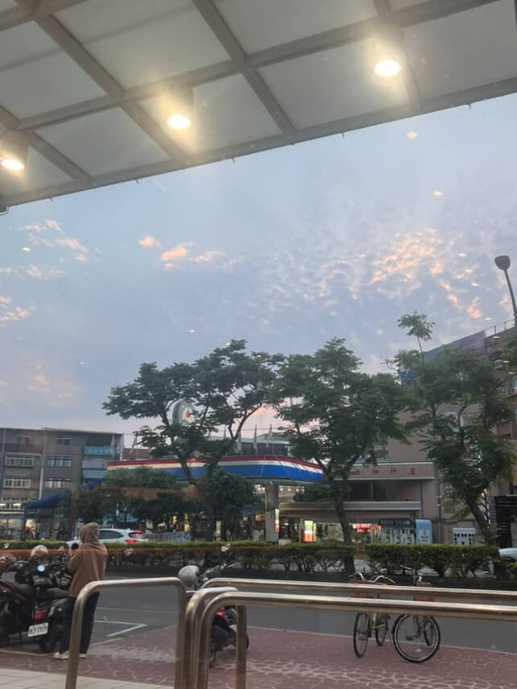
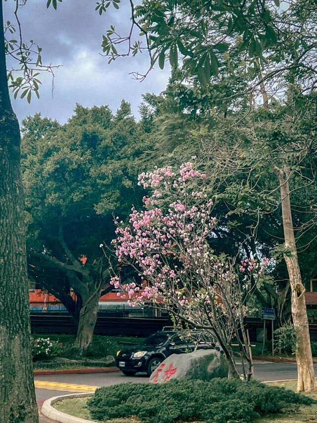
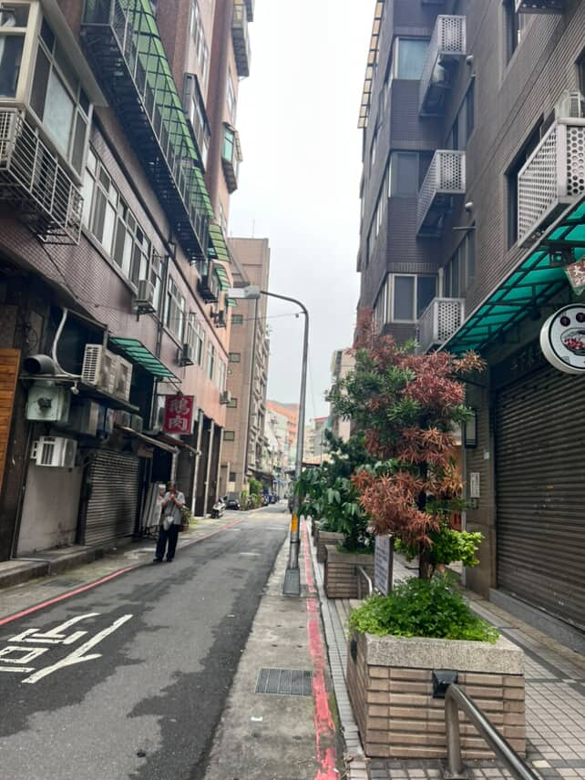
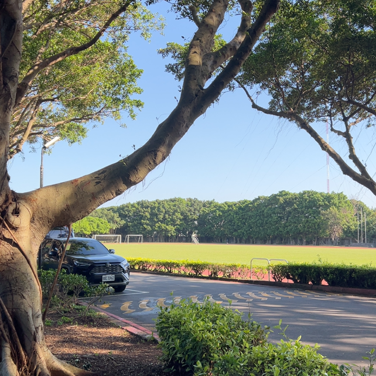

## 📸

> 👉 "She doesn't take good photos, but she enjoys taking pictures, and that's enough."

    

    
  

  

    
  

  

    
  

  

    
  

  

    
  

  

    
  

  

    
  

  

    
  

  

    
  

  

    
  

  

    
  

  

    
  

  

    
  

  

    
  

